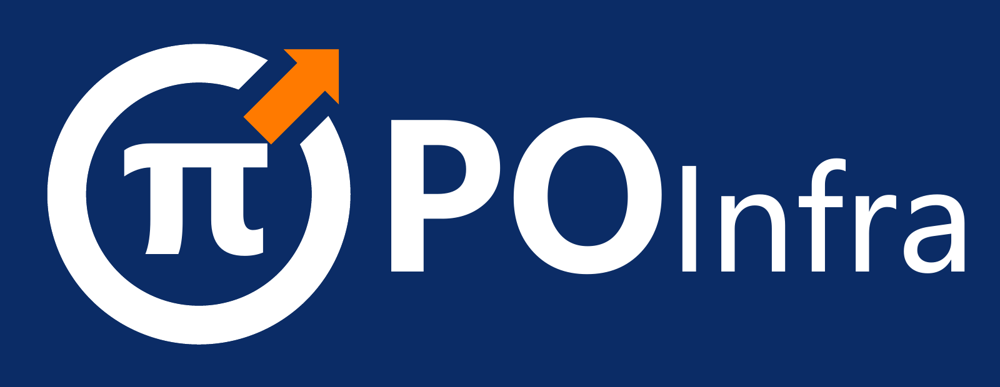
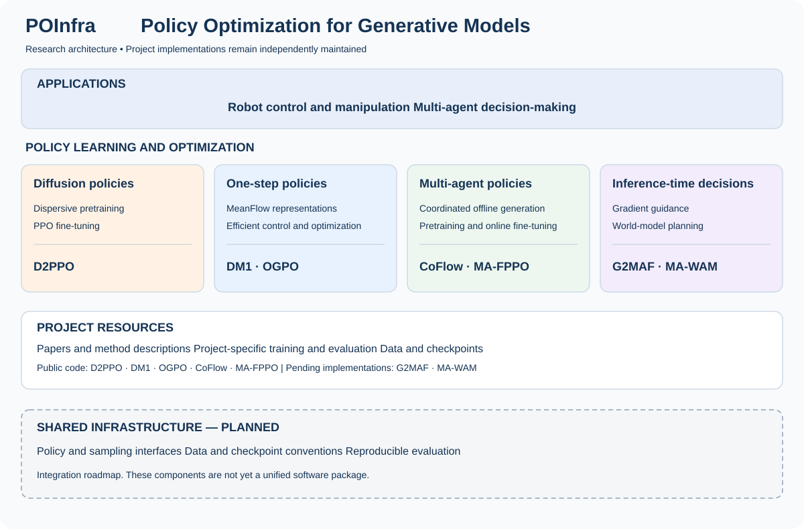
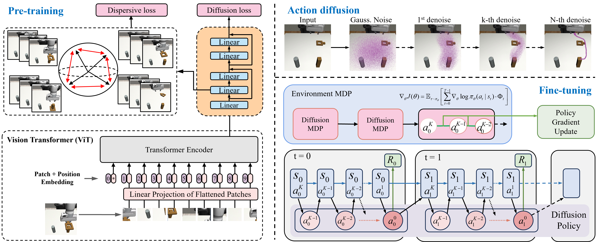
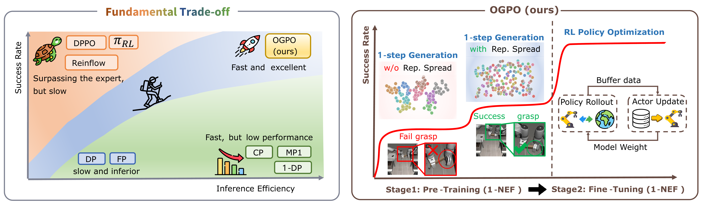
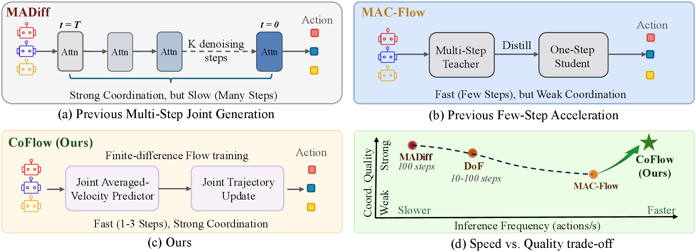
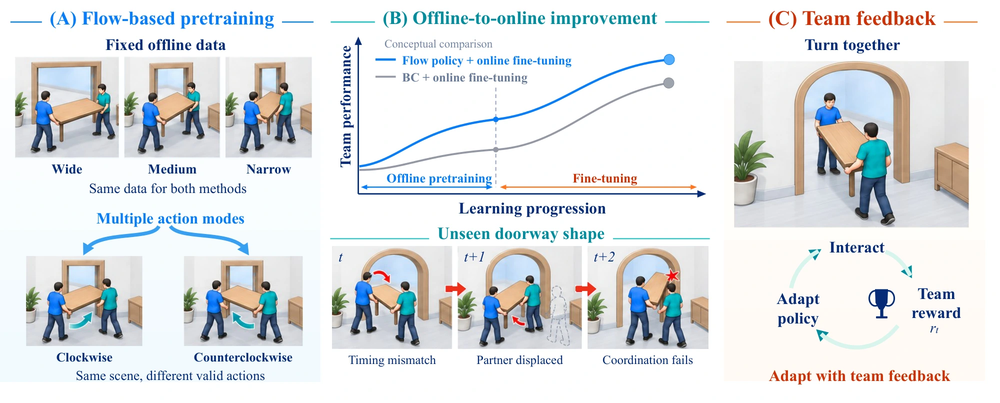
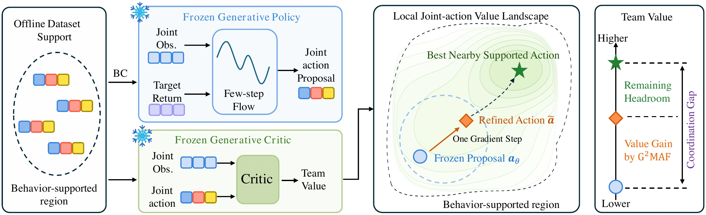
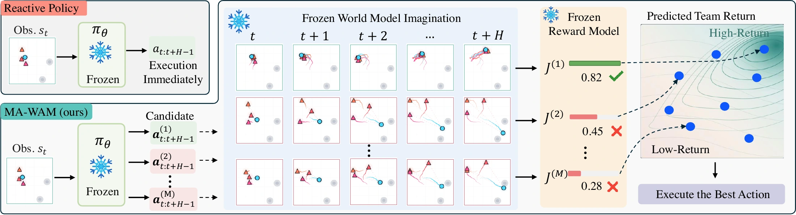

<p align="center">
  
</p>

<div align="center">
  <a href="#projects"></a>
  <a href="https://huggingface.co/Guowei-Zou"></a>
  <a href="#getting-started"></a>
  <a href="#projects"></a>
</div>

<div align="center">

[](README.md)
[](README.zh-CN.md)

</div>

<h1 align="center"><sub>POInfra: Policy Optimization for Generative Models</sub></h1>

**POInfra focuses on policy optimization for generative models.** We study how diffusion and flow models can serve as policies, how these policies can improve through reinforcement learning, and how additional computation at inference time can improve their decisions.

Our research began with **D2PPO**, which combines dispersive regularization for diffusion policy pretraining with PPO fine-tuning. The research extends to efficient one-step policies, coordinated multi-agent generation, online fine-tuning, and inference-time guidance and planning. The common goal is to turn expressive generative models into effective decision-making policies.

**PO** stands for **Policy Optimization**, and **Infra** reflects our goal of building reusable infrastructure around this research. This repository brings together the methods and resources. Available implementations currently run through their individual project repositories.

<div align="center">
  
</div>

## What's NEW!

- [2026/09] 🔥 **POInfra** is launched, bringing together our research on policy optimization for generative models, beginning with D2PPO.
- [2026/09] 🔥 **MA-FPPO** project page is available, with the paper, policy rollouts, and a presentation of multi-agent flow pretraining and online fine-tuning. [Project](https://ma-fppo.github.io/) · [Paper](https://ma-fppo.github.io/assets/MA-FPPO.pdf) · [Code](https://github.com/ma-fppo/MA-FPPO).
- [2026/07] 🔥 **G2MAF** explores test-time gradient guidance for multi-agent flow policies. [Project](https://g2maf.github.io/) · [Paper](https://arxiv.org/abs/2609.31286) · [Code](https://github.com/g2maf/G2MAF).
- [2026/07] 🔥 **MA-WAM** explores multi-agent world-action models for test-time planning. [Project](https://ma-wam.github.io/) · [Paper](https://arxiv.org/abs/2609.31281) · [Code](https://github.com/ma-wam/MA-WAM).
- [2026/05] 🔥 **CoFlow** introduces coordinated few-step flow for offline multi-agent decision-making. [Project](https://guowei-zou.github.io/coflow/) · [Paper](https://arxiv.org/abs/2605.01457) · [Code](https://github.com/Guowei-Zou/coflow-release).
- [2026/01] 🔥 The initial preprint of **OGPO**, released as DMPO, is available. The work is now accepted at **ACM MM 2026**. [Project](https://ogpo-project.github.io/) · [Paper](https://arxiv.org/abs/2601.20701) · [Code](https://github.com/ogpo-project/OGPO).

- [2025/10] 🔥 **DM1** introduces MeanFlow with dispersive regularization for one-step robotic manipulation. [Project](https://guowei-zou.github.io/dm1/) · [Paper](https://arxiv.org/abs/2510.07865) · [Code](https://github.com/Guowei-Zou/dm1-release).
- [2025/08] 🔥 **D2PPO** introduces diffusion policy optimization with dispersive loss. The work is now accepted at **AAAI 2026**. [Project](https://guowei-zou.github.io/d2ppo/) · [Paper](https://arxiv.org/abs/2508.02644) · [Code](https://github.com/Guowei-Zou/d2ppo-release).

## Key Research Directions

### Diffusion policy optimization

**D2PPO** studies representation learning in diffusion policies. Dispersive regularization is applied during pretraining, followed by PPO fine-tuning through environment interaction. This establishes the starting point of our work on learning and optimizing generative policies.

### Efficient generative policies

**DM1** investigates dispersive regularization for MeanFlow policies in robotic manipulation. **OGPO** develops one-step generative policy optimization for real-time robot control. These projects study how to retain useful generative representations while reducing the computation needed to produce actions.

### Multi-agent policy learning and optimization

**CoFlow** studies coordinated few-step trajectory generation from offline multi-agent data. **MA-FPPO** studies flow policy pretraining and online fine-tuning for multi-agent decision-making. Together, these projects extend the research to policies whose decisions must account for other agents.

### Inference-time guidance and planning

**G2MAF** studies gradient guidance for multi-agent flow policies at test time. **MA-WAM** studies multi-agent world-action models for test-time planning. These projects investigate how to improve decisions during execution through guidance or model-based planning.

## Projects

### Robot control

| Method | Research focus | Paper | Project | Code |
| --- | --- | --- | --- | --- |
| **D2PPO** | Diffusion policy pretraining with dispersive loss and PPO fine-tuning | [AAAI 2026 / arXiv](https://arxiv.org/abs/2508.02644) | [Website](https://guowei-zou.github.io/d2ppo/) | [D2PPO-release](https://github.com/Guowei-Zou/d2ppo-release) |
| **DM1** | MeanFlow with dispersive regularization for one-step robotic manipulation | [arXiv](https://arxiv.org/abs/2510.07865) | [Website](https://guowei-zou.github.io/dm1/) | [DM1-release](https://github.com/Guowei-Zou/dm1-release) |
| **OGPO** | One-step generative policy optimization for real-time robot control | [ACM MM 2026 / arXiv](https://arxiv.org/abs/2601.20701) | [Website](https://ogpo-project.github.io/) | [OGPO-release](https://github.com/ogpo-project/OGPO) |

### Multi-agent decision-making

| Method | Research focus | Paper | Project | Code |
| --- | --- | --- | --- | --- |
| **CoFlow** | Coordinated few-step flow for offline multi-agent decision-making | [arXiv](https://arxiv.org/abs/2605.01457) | [Website](https://guowei-zou.github.io/coflow/) | [CoFlow-release](https://github.com/Guowei-Zou/coflow-release) |
| **MA-FPPO** | Multi-agent flow-pretrained policy optimization | [PDF](https://ma-fppo.github.io/assets/MA-FPPO.pdf) | [Website](https://ma-fppo.github.io/) | [MA-FPPO-release](https://github.com/ma-fppo/MA-FPPO) |
| **G2MAF** | Test-time gradient guidance for multi-agent flow policies | [arXiv](https://arxiv.org/abs/2609.31286) | [Website](https://g2maf.github.io/) | [G2MAF-release](https://github.com/g2maf/G2MAF) |
| **MA-WAM** | Multi-agent world-action modeling for test-time planning | [arXiv](https://arxiv.org/abs/2609.31281) | [Website](https://ma-wam.github.io/) | [MA-WAM-release](https://github.com/ma-wam/MA-WAM) |

All linked repositories are public. G2MAF and MA-WAM currently contain a project README, with no implementation files yet. Implementation links above refer to separate project releases, rather than modules integrated into a single package.

## Research motivations

### D2PPO — Framework

<p align="center">
  <a href="https://guowei-zou.github.io/d2ppo/"></a>
</p>

[Project](https://guowei-zou.github.io/d2ppo/)

### OGPO

<p align="center">
  <a href="https://ogpo-project.github.io/"></a>
</p>

[Project](https://ogpo-project.github.io/)

### CoFlow

<p align="center">
  <a href="https://guowei-zou.github.io/coflow/"></a>
</p>

[Project](https://guowei-zou.github.io/coflow/)

### MA-FPPO

<p align="center">
  <a href="https://ma-fppo.github.io/"></a>
</p>

[Project](https://ma-fppo.github.io/)

### G2MAF

<p align="center">
  <a href="https://g2maf.github.io/"></a>
</p>

[Project](https://g2maf.github.io/)

### MA-WAM

<p align="center">
  <a href="https://ma-wam.github.io/"></a>
</p>

[Project](https://ma-wam.github.io/)

## Getting started

Choose the implementation that matches the question you want to explore:

| Goal | Starting point |
| --- | --- |
| Pretrain a diffusion policy and fine-tune it with PPO | [D2PPO setup and examples](https://github.com/Guowei-Zou/d2ppo-release) |
| Study one-step generative policies for manipulation | [DM1 setup and evaluation](https://github.com/Guowei-Zou/dm1-release) |
| Study online optimization of one-step policies | [OGPO training and evaluation](https://github.com/ogpo-project/OGPO) |
| Train coordinated flow models on offline multi-agent data | [CoFlow setup and experiments](https://github.com/Guowei-Zou/coflow-release#setup) |

For example, obtain the D2PPO implementation with:

```bash
git clone https://github.com/Guowei-Zou/d2ppo-release.git
cd d2ppo-release
```

Then follow the repository's installation instructions, environment setup, and task configurations. Each project documents its own dependencies, datasets, checkpoints, and evaluation procedure.

## Contributing

We welcome discussions about generative policy optimization, reproducibility, and components that could be shared across projects. Open an [issue](https://github.com/POInfra-AI/POInfra/issues) for cross-project ideas. For a method-specific question or bug, use the corresponding implementation repository.

## Citation

Please cite the papers corresponding to the methods and resources you use. BibTeX entries are available in each project's repository or website. The linked arXiv record for OGPO also contains the earlier DMPO preprint history.

## Maintainer

[Guowei Zou](https://github.com/Guowei-Zou) · Sun Yat-sen University
